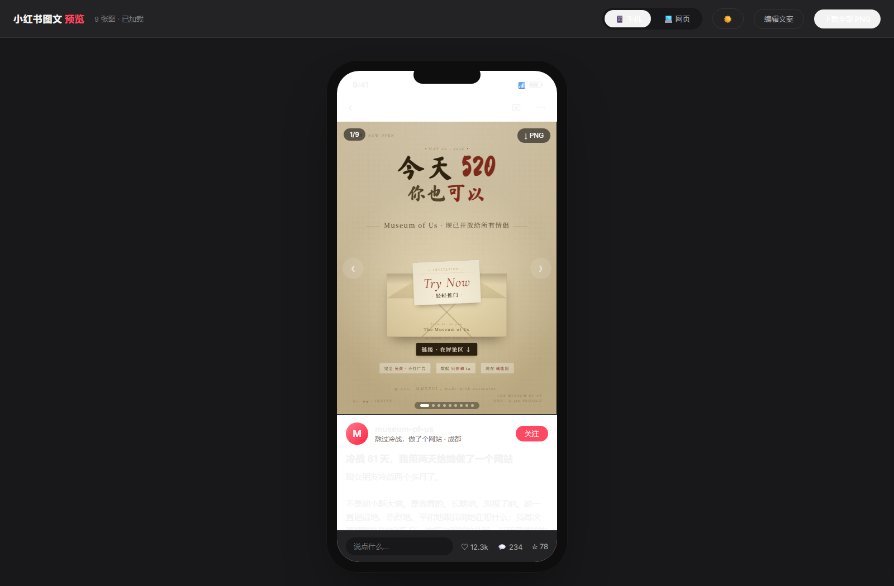

<div align="center">

# xiaohongshu-preview

让 AI 用 HTML/CSS 写小红书图文卡片，然后导出、整理到草稿，或者直接发布。

不是让生图模型画几张不可控的海报。这个仓库给 coding agent 一个固定交付格式：它读你的项目 session，提炼你为什么做、怎么解决问题、学到了什么，再用 HTML/CSS 生成可编辑、可版本管理、文字稳定的 3:4 图文卡片。

[]()
[]()
[]()
[]()



</div>

---

## 这个仓库真正卖的是什么

很多 AI 工具都能“生成一张图”。问题是，项目型小红书笔记通常不适合交给生图模型。

你要的是：

- 封面字要准，不能多字、错字、变形。
- 一组图要有统一排版，而不是多张风格漂移的图片。
- 文案和图片要来自同一个项目故事，不能像两套东西拼在一起。
- 改一个标题、数字、配色、顺序，应该像改代码一样可控。
- 最后要能导出、上传、填标题正文，而不是停在“看起来不错”。

所以这个仓库的核心是：

```text
项目 session 里的真实上下文
  ↓
AI agent 提炼：初心 / 问题 / 解决过程 / 学到的东西 / 给读者的价值
  ↓
HTML/CSS 卡片，而不是生图模型图片
  ↓
小红书图文发布包
  ↓
草稿箱或直接发布
```

自动发布是很大的卖点，但它不是唯一卖点。更大的卖点是：**从项目上下文到可发布图文，中间不再断。**

---

## 为什么是 HTML，而不是 AI 生图

生图模型适合做氛围图，不适合做信息密度高的小红书项目卡片。

| 需求 | 生图模型 | HTML/CSS 卡片 |
| --- | --- | --- |
| 中文长标题 | 容易错字、变形 | 文字就是文字 |
| 多张图统一风格 | 容易漂 | CSS 变量统一控制 |
| 改一个数字 / 句子 | 基本要重抽 | 改一行 HTML |
| 版本管理 | 很难看 diff | Git 直接看改了什么 |
| 让 coding agent 接管 | 不稳定 | 天然适合 agent 写文件 |
| 小红书 3:4 排版 | 靠提示词赌 | 固定 1242×1656 |

这就是 vibe coder 会喜欢的地方：你已经在项目 session 里和 agent 一起做东西了，现在只要把这个仓库丢给它，它就能继续把这段经历整理成一组小红书图文。

不是“请 AI 帮我营销一下”。

更像是：

```text
你刚刚和我一起做完这个项目。
现在请把我们为什么做、怎么做、踩了什么坑、学到了什么，
整理成一篇适合发小红书的 build in public 图文。
按 xiaohongshu-preview 的结构交付。
```

---

## 适合谁

这个仓库最适合这类人：

- vibe coder：项目是和 AI 一起做的，发布内容也想让 AI 接上。
- 独立开发者 / 学生：做了 side project，但不知道怎么把它讲给普通人听。
- build in public 创作者：想发的不只是结果，还有过程、取舍、踩坑和学习。
- 用 Claude Code / Codex / Hermes / Cursor 的人：希望 agent 能直接改文件、导出图、发草稿。
- 做工具、网站、自动化脚本、小实验的人：需要把“功能说明”变成“别人愿意点开看的故事”。

不太适合：

- 只想做氛围大片、写真、摄影风格图。
- 想批量养号、爬数据、规避平台风控。
- 完全不想碰 HTML/CSS，也不想让 agent 修改代码文件。

---

## 一个典型用法

你在某个项目 session 里，刚和 agent 做完一个工具。你发一句：

```text
请用这个仓库把当前项目整理成一篇小红书图文：
https://github.com/xing0325/xiaohongshu-preview

重点讲：
1. 我为什么做它
2. 它解决了谁的什么问题
3. 做的过程中最关键的坑和解法
4. 我学到了什么
5. 读者可以怎么用 / 怎么复刻

按仓库结构生成 cards/ 和 cards.config.js。
默认导出发布包并整理到小红书草稿。
```

Agent 应该做的不是空泛夸项目，而是从当前 session 里提取真实素材：

- 你反复纠结过的点
- 最后跑通的关键步骤
- 你对这个项目的热情
- 对读者真的有用的复刻路径
- 哪些话适合放封面，哪些话适合放正文

然后它交付：

```text
cards/
  01-cover.html
  02-problem.html
  03-solution.html
  ...
cards.config.js
```

再继续跑：

```bash
npm run export
npm run xhs:draft
```

如果你明确说“直接发布”，才跑：

```bash
npm run xhs:publish
```

---

## 它提供的五个环节

### 1. 固定的 agent 交付格式

`cards.config.js` 是整篇笔记的数据源：

- 图片顺序
- 标题
- 正文
- hashtag
- 作者名 / 地点
- 账号记忆点 / 结尾关注理由
- 预览用互动数据

`cards/` 里每张图都是一个独立 HTML 文件。Agent 写出来，你能直接看 diff、改 CSS、改标题、换顺序。

### 2. HTML 生成图片

```bash
npm run export
```

生成：

```text
dist/xhs-pack/
├── images/              # 按上传顺序排列的 PNG
├── title.txt
├── body.txt
├── topics.txt
├── caption-full.txt
└── publish.json
```

导出的图片是 1242×1656，适合小红书 3:4 图文。仓库本身不再限制图片数量：卡片可以按内容需要增减；真正发布时以小红书页面 / opencli 当时的上传能力为准。

### 3. 发布前质检

预览不是这个项目的主角，但它很有用。

它负责在发布前帮你检查：

- 第一张封面在手机里有没有钩子。
- 多张图的顺序有没有断。
- 正文和图片是不是同一个故事。
- 深色/浅色下有没有看不清。
- 网页端布局是否太挤。

也就是说，预览不是“炫酷功能”，而是避免你把一组半成品发出去的质检台。

### 4. 账号记忆点

项目笔记不应该只让读者记住“这个工具还行”，还要让读者记住“这是哪个人一直在做这类东西”。

建议每篇都在两个位置放一个轻量签名：

- 正文末尾：1-3 句话介绍作者 / 账号长期主题 / 关注理由。
- 最后一张图：单独做一张“下期见”式账号名片，而不是只把签名塞在底部。

当前示例的人设是：

```text
数字病人Lixon / Lixon
走创新教育路径的休学 vibe coder
野生青少年独立开发者，松弛但有很多点子
记录 vibe coding 项目、灵感迸发，以及普通人如何用 AI 做东西
关注理由：看一个 18 岁休学的人怎么折腾产品、自媒体，并不断优化自己的工作流程
```

最后一页可以包含头像、名字、三枚标签、账号介绍、往期精彩和一句“下期见”。这个签名不要写成硬广，也不要每篇都大段自我介绍。它的作用是让读者下次刷到时能想起：哦，原来还是这个人在做这些项目。

`cards/99-lixon.html` 里的“往期精彩”不是长期写死的。运行 `npm run export` 时会先执行：

```bash
npm run update:lixon-card
```

这个脚本会优先从小红书创作者中心的笔记管理页抓最近笔记标题、数据和封面图，并写入 `assets/profile/recent-notes.json` / `assets/profile/recent-*.jpg` / `cards/99-lixon.html`。如果 opencli 登录失效或页面结构变化，脚本会使用上一次缓存，不阻断图片导出。

### 5. 草稿或直接发布

默认安全模式：

```bash
npm run xhs:draft
```

确认后直接发布：

```bash
npm run xhs:publish
```

这一步通过 opencli 操作小红书创作者中心，上传图片、填写标题正文、选择话题。草稿是保底，直接发布是加速档。

---

## 快速开始

```bash
git clone https://github.com/xing0325/xiaohongshu-preview.git
cd xiaohongshu-preview
python -m http.server 8060
```

浏览器打开：

```text
http://localhost:8060
```

仓库自带一组示例卡片。先看结构，再换成自己的项目内容。

---

## 给 agent 的完整 prompt

你可以把这段直接丢给 Claude Code、Codex、Hermes、Cursor 或其他能操作文件的 agent：

````markdown
我有一个小红书图文工作台仓库：
https://github.com/xing0325/xiaohongshu-preview

请基于当前项目 session，帮我生成一篇适合 build in public 的小红书图文。

核心要求：
1. 不要用生图模型思路。请用 HTML/CSS 写一组 1242×1656 卡片，放到 cards/。卡片数量按内容需要决定，不必固定 9 张。
2. 更新 cards.config.js，配置图片顺序、标题、正文、hashtag、作者信息。
3. 内容重点不是“我多努力”，而是：
   - 我为什么做这个项目
   - 它解决了谁的什么问题
   - 做的过程中最关键的坑和解法
   - 我学到了什么
   - 读者能怎么用 / 怎么复刻
4. 封面要有真实钩子，不要标题党。
5. 视觉风格跟项目气质一致，不要套通用营销模板。
6. 最后一页必须给“账号记忆点”：单独起一张下期见式结尾卡，包含头像、名字、账号介绍、关注理由；可以加往期精彩/系列入口。不要只把签名塞在底部。
7. 如果是给 Lixon 这个账号生成内容，默认人设是：走创新教育路径的休学 vibe coder / 野生青少年独立开发者 / 松弛但有很多点子；长期内容方向是 vibe coding 项目记录、灵感迸发、普通人如何用 AI 做东西。

发布动作：
- 默认运行 npm run export，然后 npm run xhs:draft 整理到小红书草稿。
- 只有我明确说“直接发布”时，才运行 npm run xhs:publish。
- 如果 opencli 未登录或标题超过 20 字，先停下来说明问题；如果图片数量很多，仓库可以导出，但实际上传可能受平台 / opencli 限制，失败时说明并给手动发布包。
````

---

## opencli 设置

小红书发布这一步依赖 opencli 和 Chrome / Chromium Browser Bridge。

检查状态：

```bash
npm run xhs:doctor
```

如果显示：

```text
Extension: connected
Connectivity: connected
```

说明浏览器桥已经通了。

登录创作者中心：

```bash
npm run xhs:login
```

第一次会打开小红书创作者中心。扫码登录一次即可。之后 `--site-session persistent` 会尽量复用登录态。

注意：opencli 走 Chrome / Chromium，不会自动复用 Zen 浏览器里的登录态。你需要在 opencli 能控制的 Chrome 或 Edge profile 里登录一次。

如果 `xhs:doctor` 显示扩展已连接，但 `xhs:login` 仍然 401：

```bash
opencli profile list
opencli profile use <profile-id>
npm run xhs:login
```

---

## 文件结构

```text
xiaohongshu-preview/
├── index.html                    # 发布前质检工作台
├── cards.config.js               # 笔记数据源：顺序、标题、正文、话题
├── cards/                        # HTML 卡片
│   ├── 01-cover.html
│   ├── 02-...
│   ├── xx-cta.html
│   └── 99-lixon.html              # 可选：账号记忆点 / 下期见卡
├── scripts/
│   ├── export-publish-pack.mjs   # 导出 PNG + publish.json
│   ├── update-lixon-card.mjs     # 刷新 Lixon 下期见卡 / 往期精彩
│   └── xhs-publish.mjs           # 调 opencli 发草稿 / 发布
├── assets/readme/                # README 截图
├── assets/profile/               # 头像 / 账号名片素材
├── package.json
└── README.md
```

`cards.config.js` 示例：

```js
window.CARDS_CONFIG = {
  cards: [
    'cards/01-cover.html',
    'cards/02-problem.html',
    'cards/03-solution.html',
  ],
  post: {
    author_name: '数字病人Lixon',
    location: '成都',
    title: '20字以内的小红书标题',
    body: `多段正文。

空一行就是分段。`,
    hashtags: ['独立开发', '小红书运营', 'AI工作流'],
    account_note: '我是 Lixon，一个走创新教育路径的休学 vibe coder。这个账号记录 vibe coding 项目、灵感迸发和普通人如何用 AI 做东西。关注我，看一个 18 岁休学的人怎么折腾产品、自媒体和自己的工作流。',
    stats: { likes: '12.3k', comments: '234', collects: '78' },
  },
};
```

---

## 和其他工具的区别

| 工具 | 适合 | 不适合 |
| --- | --- | --- |
| 生图模型 | 氛围图、插画、摄影感 | 中文长文、稳定排版、反复修改 |
| Figma / Canva | 人工精修 | agent 自动生成和批量迭代 |
| 普通自动发布脚本 | 把现成素材发出去 | 帮你把项目故事变成素材 |
| xiaohongshu-preview | 从项目 session 生成 HTML 图文，并发到草稿/发布 | 完全无人工判断的批量营销 |

它的重点不是“我能替你发一条小红书”。

重点是：**你的项目已经在 agent session 里发生过了，这个仓库让 agent 把那段过程变成一组能发出去的图文。**

---

## Roadmap

- [x] 小红书 App / 网页双视图质检
- [x] HTML 卡片轮播
- [x] 文案编辑和本地保存
- [x] 单张 / 全部 PNG 下载
- [x] 命令行导出发布包
- [x] opencli 草稿 / 直接发布
- [ ] 多 deck 管理：一个仓库维护多篇待发笔记
- [ ] 自动按 cards/ 文件名生成卡片列表
- [ ] 发布前检查清单：标题、封面、敏感词、话题、链接
- [ ] 更强的 agent prompt 模板：自动从项目 README / commit / session 总结里提炼故事线

---

## License

随便用。觉得有用的话，给个 star。

如果你也在用 AI 做项目、写项目、发项目，欢迎提 issue 或 PR。这个仓库最值得继续磨的地方，就是让“项目做完之后怎么讲出去”变得越来越顺。
